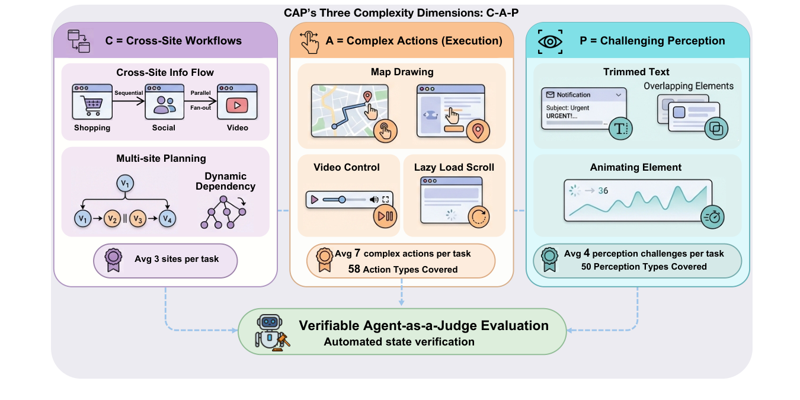
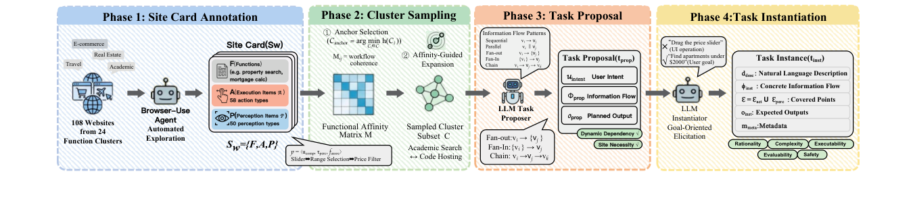
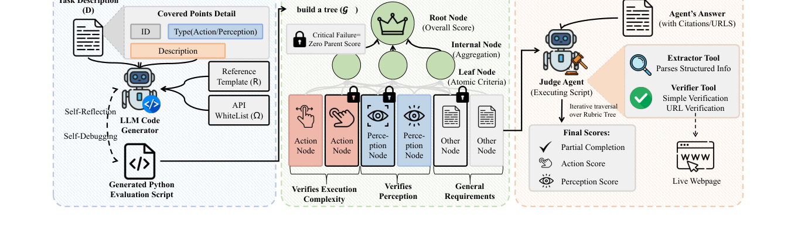

<h1 align="center">CAP-Bench</h1>

<p align="center">
  <em>A Scalable Benchmark for Evaluating Cross-Site Browser Agents<br/>with Complex Actions and Perception</em>
</p>

<p align="center">
  <a href="https://huggingface.co/datasets/Warrior0302/CAP"></a>
  <a href="LICENSE"></a>
  <a href="#"></a>
  <a href="#"></a>
  <a href="#"></a>
</p>

<p align="center">
  
</p>

CAP targets three sources of difficulty in real-world web browsing — **C**ross-site workflows, complex **A**ctions, and challenging visual **P**erception — and evaluates agents through a *verifiable agent-as-a-judge* framework with explicit execution and perception checkpoints. It contains **420 tasks** across **108 real-world websites** in **24 functional domains**.

This repository hosts:

- **`src/construct/`** — the decomposition-and-recomposition pipeline that turns websites into structured site cards and recomposes them into cross-site task instances.
- **`src/evaluate/`** — *CAP-Eval*, the verifiable agent-as-a-judge framework that materializes per-task rubric trees and scores agent answers against live webpages.

## Resources

| | Link |
|---|---|
| Dataset (public split, 192 tasks) | [`Warrior0302/CAP`](https://huggingface.co/datasets/Warrior0302/CAP) on Hugging Face |
| Paper (arXiv) | *Coming soon* |
| Issues / discussion | [GitHub issues](https://github.com/WarriorXu0302/CAP-Bench/issues) |

> The held-out **private split (228 tasks)** is reserved for contamination-resistant evaluation. Submission instructions for the leaderboard will be published with the arXiv release.

## Repository Layout

```
src/
├── construct/         # Task construction pipeline (sample → propose → refine)
└── evaluate/          # CAP-Eval framework (rubric tree + judge agent)
scripts/
└── download_dataset.py  # Materialize the HF public split as per-task JSON files
```

## Installation

CAP-Bench has two largely independent components. You can install the one you need.

### Construct pipeline (root)

```bash
pip install -r requirements.txt
cp .env.example .env   # then fill in OPENAI_API_KEY / OPENAI_BASE_URL
```

### Evaluate pipeline (`src/evaluate/`)

CAP-Eval is its own Python package and drives a real Chromium for webpage capture.

```bash
cd src/evaluate
uv sync && source .venv/bin/activate     # or: pip install -e .
patchright install                        # installs the Chromium engine
```

Set the API credentials your evaluation will use:

```bash
export OPENAI_API_KEY="..."
export OPENAI_BASE_URL="..."   # optional; any OpenAI-compatible endpoint
# Optional providers:
export AZURE_OPENAI_API_KEY="..."
export AZURE_OPENAI_ENDPOINT_URL="..."
export AZURE_OPENAI_API_VERSION="2025-03-01-preview"
export GOOGLE_MAPS_API_KEY="..."   # only needed by tasks that hit Google Maps
```

## Quickstart

### 1. Get the public task split

```bash
pip install datasets
python scripts/download_dataset.py
# → writes src/evaluate/tasks/task-*.json (192 files)
```

Or load directly in Python:

```python
from datasets import load_dataset

ds = load_dataset("Warrior0302/CAP")
print(ds["test"][0])
# {'task id': 'task-035e06', 'instruction': '...'}
```

### 2. Run an agent and collect answers

Drop your agent's answers as Markdown files under:

```
src/evaluate/answers/<agent_name>/<task_id>/answer_<n>.md
```

Each answer file is a Markdown document, optionally with URL citations.

### 3. Generate evaluation scripts (one-time per task)

```bash
cd src/evaluate
python generate_eval.py --json_path /path/to/task-XXXXXX.json
# Or batch over a directory of tasks:
ANSWERS_DIR=answers/<agent_name> JSON_BASE_DIR=tasks bash run_eval_batch.sh
```

### 4. Score the agent

```bash
cd src/evaluate

# Single task
python run_eval.py --agent_name <agent> --task_id task-035e06

# All tasks for an agent
python run_eval.py --agent_name <agent>

# Aggregate metrics across all answers
python count.py
```

`run_eval.py` reports four metrics (paper §5):

- **Partial Completion** — mean root-node score across tasks.
- **Success Rate** — fraction of tasks with a perfect score.
- **Complex-A** — mean leaf score over action nodes.
- **Complex-P** — mean leaf score over perception nodes.

See `src/evaluate/README.md` for the full CLI reference and concurrency knobs.

### 5. Construct new tasks (optional)

The construction pipeline expects site cards under `assets/sitecard/` (see `src/construct/datasets/sitecard.py`). With those in place:

```bash
python src/main_construct.py --total 100 --num 10
```

## Architecture

### Construction Pipeline

<p align="center">
  
</p>

For each website *w* we annotate a *site card* `s_w = ⟨F, A, P⟩` of user-facing functions, complex execution items, and perception items. Site cards are sampled into coherent cross-site subsets via a functional-affinity matrix, and an LLM proposer + instantiator turn those subsets into concrete task instances with explicitly annotated *covered points*. The pipeline runs in four phases: site card annotation → cluster sampling → task proposal → task instantiation.

### Verifiable Agent-as-a-Judge Evaluation

<p align="center">
  
</p>

Each task is automatically converted into a Python evaluation script that materializes a hierarchical rubric tree. Leaves are typed as **action**, **perception**, or **other**, and may be marked critical (failure zeroes its parent). A judge agent traverses the tree, extracts structured information from the agent's answer, and verifies each claim against live webpages.

## Leaderboard

Results on the public split. Numbers are means with one standard deviation.

| System                 | Partial Completion | Success Rate | Complex-A    | Complex-P    |
|------------------------|--------------------|--------------|--------------|--------------|
| **Commercial**         |                    |              |              |              |
| Comet                  | **48.0** ± 3.5     | 6.0 ± 1.5    | **67.0** ± 4.2 | **58.0** ± 3.8 |
| Fellou                 | 24.0 ± 2.0         | 7.0 ± 2.0    | 28.0 ± 1.9   | 25.0 ± 2.1   |
| Manus                  | 23.0 ± 3.0         | **8.0** ± 2.0 | 33.0 ± 2.5  | 29.0 ± 2.0   |
| Dia                    | 19.0 ± 2.0         | 4.0 ± 1.0    | 28.0 ± 1.5   | 23.0 ± 2.2   |
| Genspark               | 16.0 ± 2.0         | 5.0 ± 1.0    | 30.0 ± 2.1   | 28.0 ± 1.8   |
| **Browser-Use**        |                    |              |              |              |
| Claude-4.5-Sonnet      | 21.0 ± 3.0         | 5.0 ± 2.0    | 32.0 ± 2.4   | 32.0 ± 2.5   |
| GPT-5                  | 15.0 ± 1.0         | 2.0 ± 1.0    | 29.0 ± 2.0   | 23.0 ± 1.5   |
| **Human**              | 35.0 ± 4.5         | 10.0 ± 2.5   | 35.0 ± 3.0   | 34.0 ± 2.8   |

Even the strongest agent reaches only **8.0%** Success Rate, and perception-heavy interactions remain a major bottleneck — see paper §5 for fine-grained findings.

## Cache Manager

Webpage retrieval is rate-limited and noisy. `src/evaluate/cache_manager_web/` is a small FastAPI + browser-extension tool to inspect and re-capture problematic cached pages. See `src/evaluate/cache_manager_web/README.md`.

## License

CAP-Bench is released under the [Apache License, Version 2.0](LICENSE). See [`NOTICE`](NOTICE) for third-party attribution. The dataset itself is published under CC BY 4.0 on Hugging Face.

## Citation

```bibtex
@misc{cap2026,
    title  = {CAP: A Scalable Benchmark for Evaluating Cross-Site Browser Agents with Complex Actions and Perception},
    year   = {2026},
    note   = {Preprint, arXiv link forthcoming}
}
```

## Acknowledgements

The CAP-Eval framework extends [Mind2Web2](https://github.com/OSU-NLP-Group/Mind2Web2) (Gou et al., 2025). We thank the OSU NLP Group for releasing it under MIT, on which we built our verifiable rubric-tree extension. See `NOTICE` for details.
